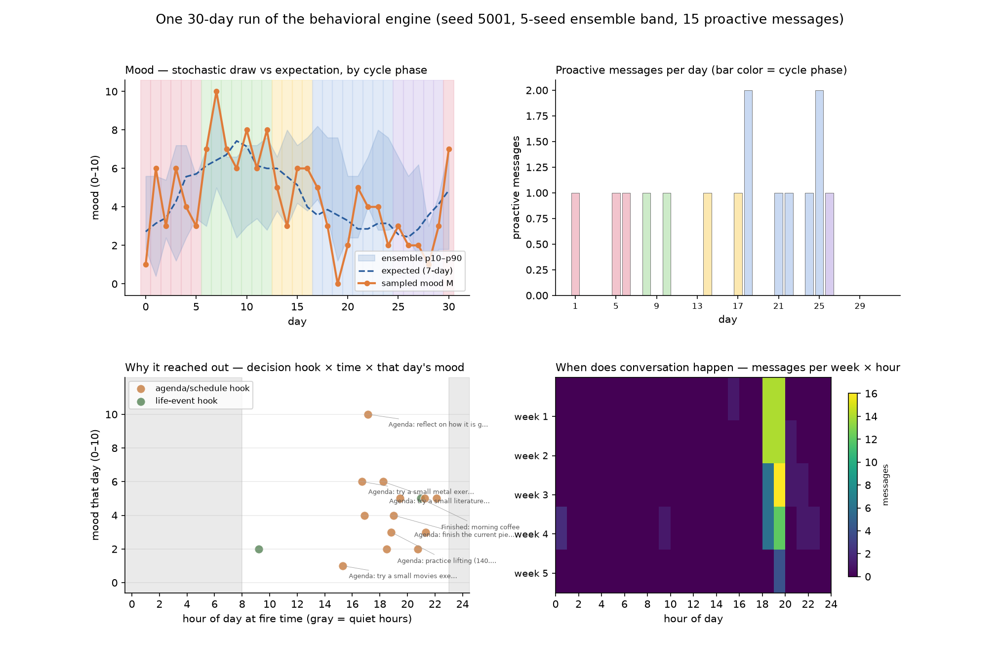
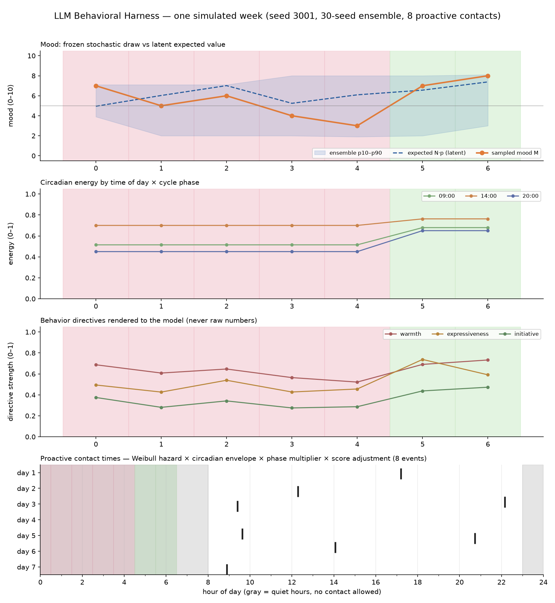
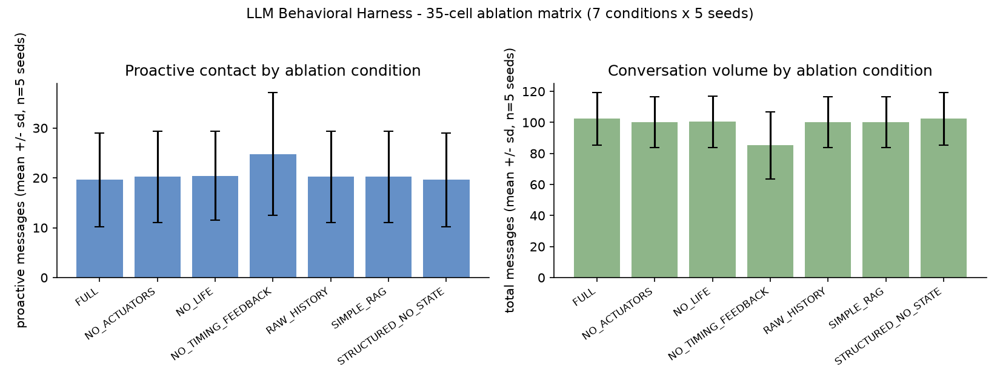

# LLM Behavioral Harness

An OpenAI-compatible harness that gives any LLM **initiative** and **measurable
behavioral variability** — mood with memory, a simulated ~28-day cycle, circadian
energy, and shifts in cadence, length, and warmth. The engine never modifies the
base model; it operates entirely in the orchestration layer. The model is swappable.



*One 30-day run (seed 5001): sampled mood vs its 7-day expectation over cycle
phases with a 5-seed ensemble band; proactive messages per day colored by phase;
every proactive decision plotted at its fire hour against that day's mood, with
its actual hook text ("Agenda: practice lifting…", "Finished: morning coffee");
and when conversation happens across the month. Data: real engine runs from
`results/it3-backfill-2026-08-09`. Reproduce with
`python -m experiments.month_showcase`.*

<details>
<summary>More views</summary>



*One week at engine granularity: circadian energy by time-of-day × phase, and
the behavior directives those states render into (natural-language briefs — the
model never sees numbers). Reproduce with `python -m experiments.week_showcase`.*



*35-cell ablation matrix (7 conditions × 5 seeds). Removing the timing-feedback
channel measurably changes proactive behavior; removing internal state does not
— a clean negative result, reported with controls.*

</details>

<details>
<summary>Ablation evidence</summary>


*Proactive contact and conversation volume across the 35-cell ablation matrix
(7 conditions × 5 seeds). Removing the timing-feedback channel measurably changes
proactive behavior; removing internal state does not — a clean negative result,
reported with controls. Chart: `docs/ablation-matrix-summary.png`.*

</details>

*Proactive contact and conversation volume across the 35-cell ablation matrix
(7 conditions × 5 seeds). Removing the timing-feedback channel measurably changes
proactive behavior; removing internal state does not — a clean negative result,
reported with controls.*

## What it is

A research instrument and a deployed system at the same time:

- **Frozen stochastic engine** (`engine/`) owns timing, opportunity windows, and
  affect state. The LLM only decides *whether and how* to act within them; every
  decision is persisted with a replay ID.
- **Behavioral briefs, never raw numbers** — state renders into natural-language
  briefs; a forbidden-token test battery machine-enforces that no numeric state
  leaks into prompts.
- **The LLM judge as a noisy sensor** — empirically estimated neutral point,
  temperature-0 anchored rubric, test–retest repeatability checks, documented
  recalibration. The judge sits inside the system's only closed loop, so it is
  measured like any other instrument.
- **Replayability** — every stochastic step and LLM call persists with seeds and
  a repro bundle; deterministic seed-keyed RNG replays are byte-identical across
  resume.

## Evidence, not claims

| Artifact | What it shows |
|---|---|
| [Preregistered 8-criterion study](results/fase-1-informe.md) | 5 waves, 10-seed verification, explicit PASS/FAIL per criterion |
| [35-cell ablation matrix](results/it2-g6-matrix/traces.md) | 7 conditions × 5 seeds; each condition ablates exactly one channel |
| [Horizon-split reconciliation](results/it3-g2-horizon-split-reconciliation-2026-08-10.md) | A gate that passed but the mechanism did not work — documented with corpus receipts |
| [Decision probes r1–r3](results/decision-probe-real-2026-08-14-r3/) | 90 real model calls/run; exposed silent tool-protocol failures in a frontier model |
| [30-day behavior showcase](results/behavior-showcase/) | Reproducible emulation: mood trajectories, phase semantics, auditable traces |

Null results are reported as nulls: the affect-codebook classifier landed at
chance (~0.31 vs 0.33) with a passing control to rule out instrument failure,
and the Spike2 behavioral-eval machinery was shelved with a decision memo rather
than quietly dropped.

## Architecture

```
engine/      frozen contracts: mood (beta-binomial in logit space, AR(1)
             event memory), ~28-day cycle, circadian energy, Weibull
             hazard contact timing, seed-keyed RNG, validation
harness/     41 modules / ~16K lines: three-tier prompt assembly
             (system core → state card → volatile tail), steering,
             scheduler, judge, spend ledger, negotiation, memory,
 summarization, proactive decisions, actuation
experiments/ 36 preregistered experiment scripts under experiments/
```

Scale: 311 commits, 1,371 tests collected on the current tree, single-file
SQLite (WAL, 8 migrations) with append-only `state_events` + `llm_calls` so
`audit.py` reconstructs exactly "what the model saw" per call.

## Design docs

- [`DESIGN.md`](DESIGN.md) — architecture and mathematics of the system.
- [`docs/design-note-cognition-principle-2026-08-15.md`](docs/design-note-cognition-principle-2026-08-15.md) — the engine owns timing, the model owns the decision.
- [`docs/context-flow-2026-08-14.md`](docs/context-flow-2026-08-14.md) — prompt assembly flow diagram.

## Honest caveats

Solo project, mostly single-model; live ablation is single-seed-per-cell —
"directional, not inferential." Blind human rating is the recommended follow-up.

---

<details>
<summary>Running it (for reviewers who want to reproduce)</summary>

```bash
# reproducible 30-day emulation (no network needed)
MPLBACKEND=Agg .venv/bin/python -m experiments.behavior_showcase

# outputs: results/behavior-showcase/{30-day-behavior.png, phase-semantics.png,
#          phase-summary.json, behavior-trace.json}
```

Test suite: `.venv/bin/python -m pytest -q` (1,371 tests collected).

</details>
