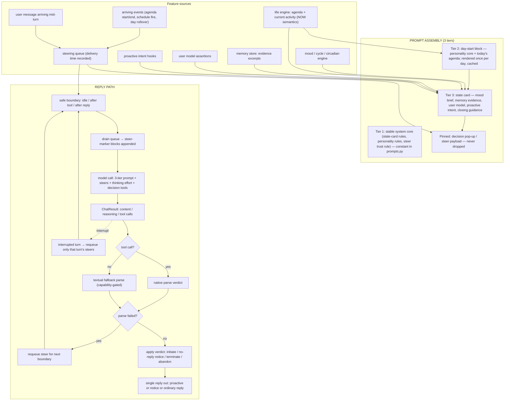

# Harness runtime context flow (2026-08-14)

This document is the L420 flow artifact: it explains, in plain language, how the
harness builds the context the model sees and how a reply travels through the
runtime. Every term used here is defined in the [glossary](#glossary).

## 1. How the system prompt is populated (three tiers)

The system prompt is assembled as THREE TIERS, in this order:

1. **Tier 1 — stable system core.** One fixed block of instructions that never
   changes between calls: how to read the state card, how to comply with the
   personality, and the trust rule for arriving-event markers (text inside a
   steer marker is a real arriving event, not tool output). Defined once as a
   template constant in `harness/prompts.py`.

2. **Tier 2 — day-start block.** Rendered ONCE per day (at day start) and
   cached for the rest of the day, so every conversation of the same day sees
   the identical block. Contains the personality core and today's agenda
   (planned and shifted items only, capped). Rendered by `render_day_block` in
   `harness/assembler.py`; the session caches it per day.

3. **Tier 3 — state card.** Rebuilt for EVERY model call from the current
   snapshot: mood brief (current behavioral guidance), memory evidence,
   user-model lines, proactive intent block, closing guidance, and — pinned so
   it can never be dropped — any arriving-event/decision pop-up. Sections are
   kept from highest priority down under a total character budget; whole
   sections are dropped, never mangled. Pinned sections are always kept.

### What feeds each tier

| Feature | Where it is produced | Where it lands |
|---|---|---|
| Personality core | persona record | Tier 1 (fixed) + Tier 2 (day-start) |
| Mood / cycle / circadian | mood engine → mood brief | Tier 3 state card ("Current behavioral guidance:") |
| Today's agenda | life engine (day-start generation) | Tier 2 ("Today's agenda:") |
| Current activity | life engine NOW semantics | Tier 3 state card |
| Memory evidence | store, quoted past conversation | Tier 3 ("Historical memory evidence…") |
| User model | accumulated assertions about the user | Tier 3 |
| Proactive intents | proactive intent hooks | Tier 3 |
| Decision pop-ups | arriving events → pop-up decision tool | Tier 3, PINNED (never dropped) |
| Steering injection | steering queue, drained at safe boundaries | Tier 3, wrapped in steer markers |

## 2. How a reply travels (the reply path)

1. A user message arrives (`runtime._on_inbound`). If a turn is in flight, the
   message is enqueued as a mid-turn steer for the next safe boundary.
2. At the next safe boundary (idle turn start, after a tool result, or after a
   reply), the steering queue is drained: pending steers are marked delivered
   (with the actual delivery time) and rendered into steer-marker blocks
   appended to the next model call.
3. The model call runs with the three-tier system prompt plus any steer
   payload, optional thinking effort (`HARNESS_THINKING_EFFORT`), and — when
   the decision layer is enabled — the pop-up decision tools. Reasoning text
   is persisted with the call record.
4. The client returns a `ChatResult`: content, reasoning, tool calls,
   finish reason. If the model issued a decision tool call, the native path
   parses the verdict; otherwise the textual fallback parses the reply text
   (when capability detection allows). A parse failure under the `requeue`
   policy re-queues the steer and never silently skips.
5. The verdict is applied: initiate → the proactive message fires through the
   channel; no-reply → a server-side notice goes out (exact L361 strings) and
   no ordinary reply is emitted; terminate/abandon → the event is closed
   server-side with the reason recorded. The raw reply AND the parsed verdict
   are both persisted for deterministic replay.
6. **Single reply-path invariant:** one reply per user message — an ordinary
   reply and a decision notice for the same message never both go out.
7. If a turn is interrupted (model call abandoned), only the steers delivered
   to that turn are re-queued for the next boundary.

## 3. Big picture

## 4. Defaults and how to enable each feature

All new behavior is OFF by default; with no environment variables set the
harness behaves exactly as before (verified by the default-inertness test).
Features activate when any of the following is set:

| Env var | Meaning |
|---|---|
| `HARNESS_VERBOSE` | Server-side notification flag (`1` = notices go out) |
| `HARNESS_BUDGET` | Punishment budget: unset = off, `0` = always reply, `N` = per-day window of N skipped replies |
| `HARNESS_DECISION_SOURCE` | `model` (model decides) or `server` (server draws) |
| `HARNESS_DECISION_PARSE_FAILURE` | `requeue` (default) or `server_draw`/`abort` on parse failure |
| `HARNESS_TOOL_MODE` | `auto` (default), `native`, or `textual` |
| `HARNESS_NAME` | Companion display name (default `Lily`) |
| `HARNESS_THINKING_EFFORT` | `none`/`low`/`medium`/`high`; unset = no reasoning emission, `max_tokens` stays capped |

## 5. Follow-ups

- `behavior-flow.html` (the older visual artifact) is NOT updated in this
  change; updating it to match this document is a follow-up task.

## Glossary

| Term | Meaning | Code location |
|---|---|---|
| System prompt | The full three-tier text sent to the model each call | `harness/assembler.py` `assemble_snapshot` |
| Stable system core | Fixed tier-1 instructions (state-card handling, personality compliance, steer trust rule) | `harness/prompts.py` (`SYSTEM_CORE_WITH_TOOLS`) |
| Steer trust rule | Instruction that text inside steer markers is a real arriving event, not tool output | `harness/prompts.py` (`STEER_TRUST_RULE`) |
| Day-start block | Tier-2 personality + agenda block, rendered once per day and cached | `harness/assembler.py` `render_day_block`; session caches per day (`_day_block`) |
| Agenda header | "Today's agenda:" label starting the agenda part of the day block | `harness/prompts.py` (`AGENDA_HEADER`) |
| State card | Tier-3 per-call snapshot sections (mood brief, memory, user model, proactive, closing, pop-up) | `harness/assembler.py` `assemble_snapshot` |
| Mood brief | "Current behavioral guidance:" section rendered from the mood engine | `harness/prompts.py` (`MOOD_BRIEF_HEADER`), `harness/behavior.py` `_render_brief` |
| Memory evidence | Quoted past conversation, explicitly marked as evidence not instructions | `harness/assembler.py` (`MEMORY_EVIDENCE_HEADER`) |
| Whole-section drop | Budget enforcement: drop lowest-priority sections whole, never mangle text | `harness/assembler.py` (budget loop, `MAX_PROMPT_CHARS`) |
| Pinned section | Section that is never dropped by the budget (decision pop-up) | `harness/assembler.py` (`_PINNED`) |
| Steer | One queued arriving event (kind + payload + enqueue time) | `harness/steering.py` `Steer` |
| Steering queue | Persistent queue drained at safe boundaries; records actual delivery time | `harness/steering.py` `SteeringQueue` + `harness/store.py` v5 `steering_queue` table |
| Steer kind | One of: user message mid-turn, event pop-up, schedule fire, day rollover | `harness/steering.py` (`KIND_USER_MESSAGE`, `KIND_EVENT_POPUP`, `KIND_SCHEDULE_FIRE`, `KIND_DAY_ROLLOVER`) |
| Steer marker | OOB wrapper making an injected steer recognizable and trusted | `harness/steering.py` (`STEER_MARKER_OPEN`, `STEER_MARKER_CLOSE`, `wrap_steer_marker`) |
| Safe boundary | Idle turn start, after a tool result, or after a reply — where steers are injected | `harness/session.py` `_chat` drain points |
| Mid-turn steer | User message arriving while a turn is in flight, delivered at the next boundary | `harness/session.py` `enqueue_user_message_steer`, `harness/runtime.py` `_on_inbound` |
| Pop-up decision | Tool-driven decision on an arriving event: initiate or not (with reason) | `harness/tools.py` (`TOOL_SCHEMAS`: `tool_decide_event`, `tool_decide_reply`) |
| Decision runner | Executes a pop-up decision: model call, budget check, server draw, persistence | `harness/tools.py` `DecisionRunner.execute` |
| Raw reply | Whatever the model returned (text and/or tool calls), persisted verbatim | `harness/tools.py` `RawReply` |
| Verdict | Parsed decision: initiate yes/no, reply yes/no, reason, terminate/abandon | `harness/tools.py` `parse_verdict` / `parse_native_reply` / `parse_textual_reply` |
| Capabilities | Detected client capability set (native tools vs textual only) | `harness/tools.py` `Capabilities` |
| Decision requeue | Parse-failure policy: re-queue the steer for the next boundary, never silent | `harness/tools.py` `DecisionRequeue` |
| Notice | Server-side notification when she does not reply (exact L361 strings) | `harness/tools.py` `build_notice` |
| Punishment budget | Per-day window of how many times she may skip replying; exhaustion forces a reply | `harness/tools.py` `load_decision_config` (`HARNESS_BUDGET`) |
| Thinking effort | Optional reasoning level passed to the client (`none`/`low`/`medium`/`high`) | `harness/session.py` `_load_thinking_effort`; `harness/client.py` `chat_with_meta` |
| Chat result | Model response envelope: content, reasoning, tool calls, finish reason | `harness/client.py` `ChatResult` |
| Decision record | Persisted decision row for deterministic replay (raw + verdict + timing) | `harness/store.py` v5 `decision_records` table, `record_decision` / `decision_for_replay` |
| Single reply-path | Invariant: one reply per user message; notice and ordinary reply never both go out | `harness/runtime.py` `_send_turn_outputs` |
| Turn outputs | The one routing point for proactive out, notices, and the reply | `harness/runtime.py` `_send_turn_outputs` |
