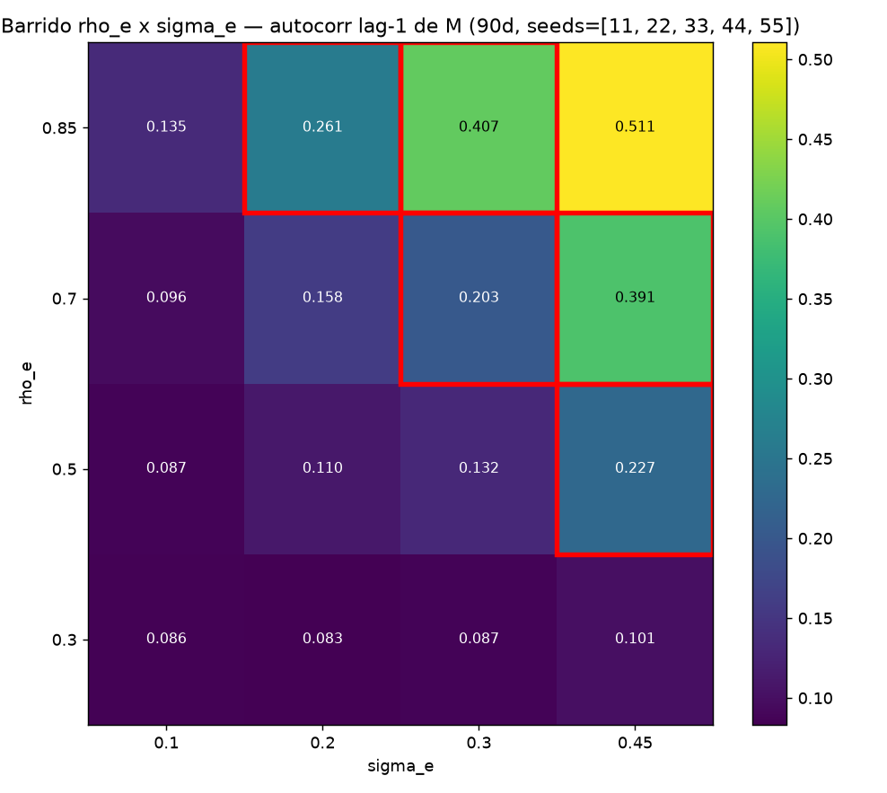
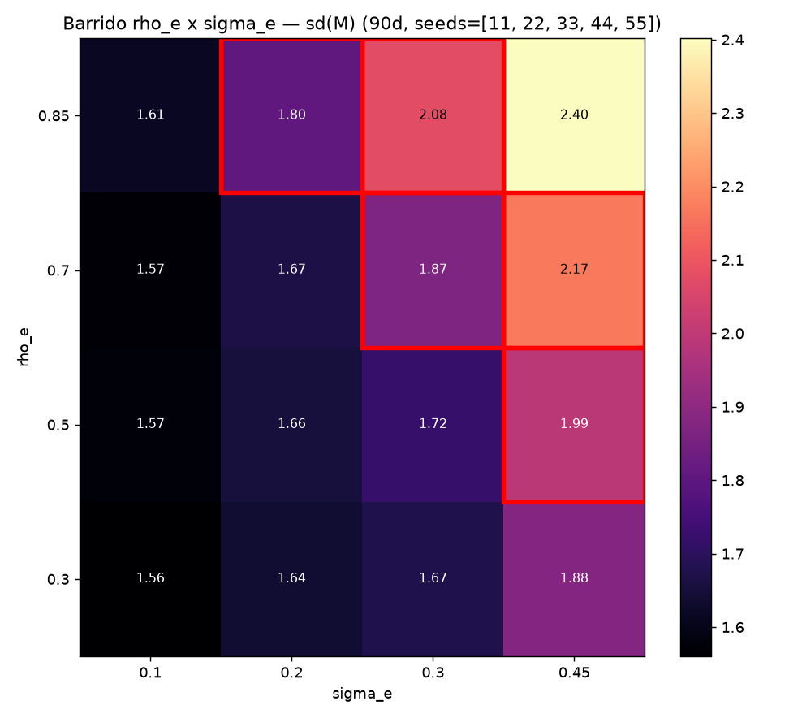
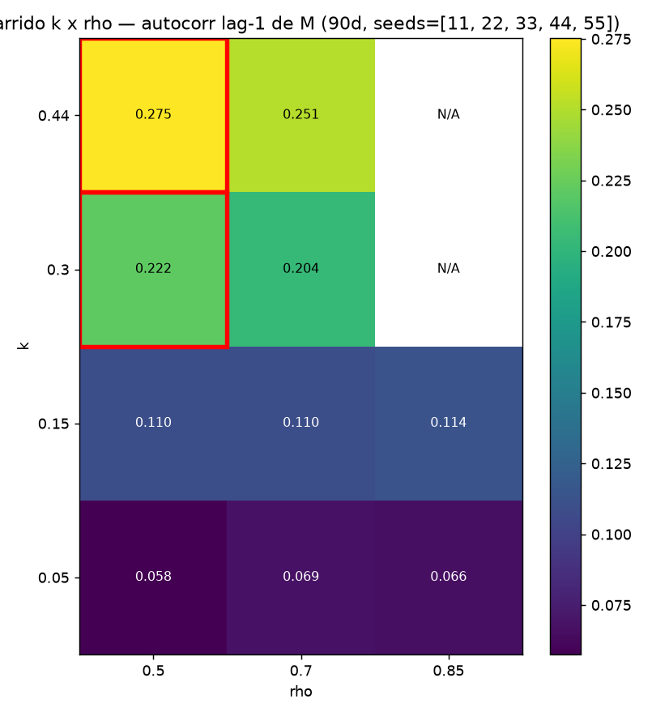
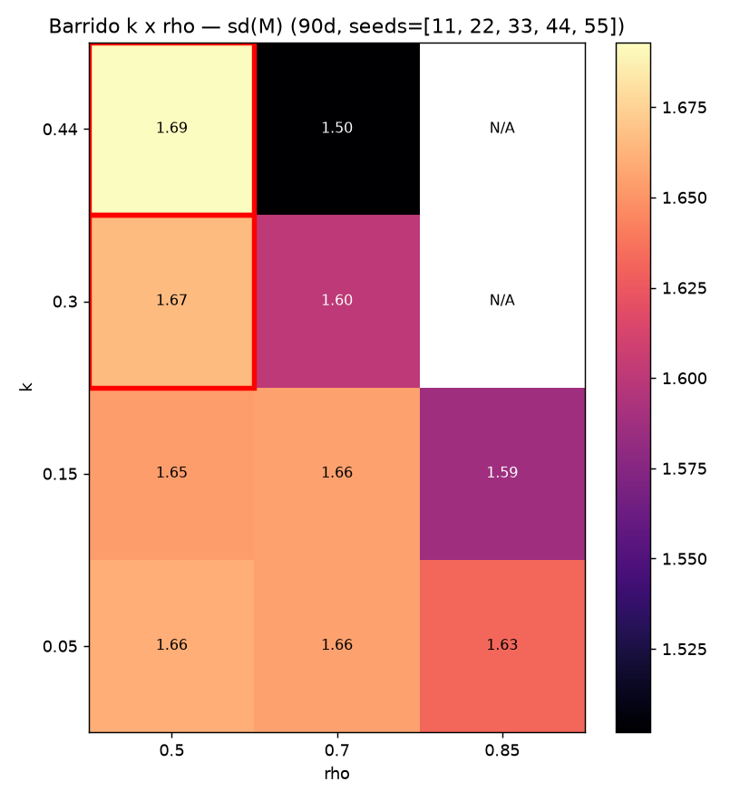
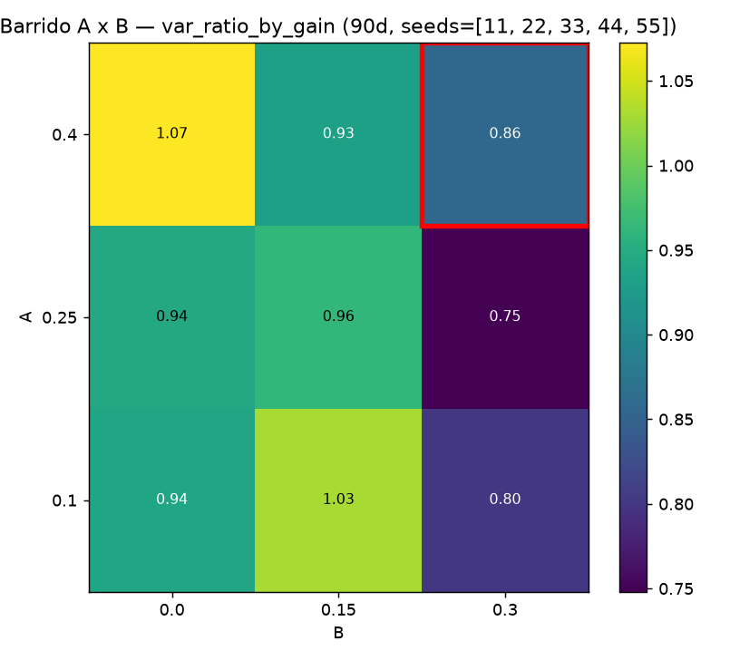
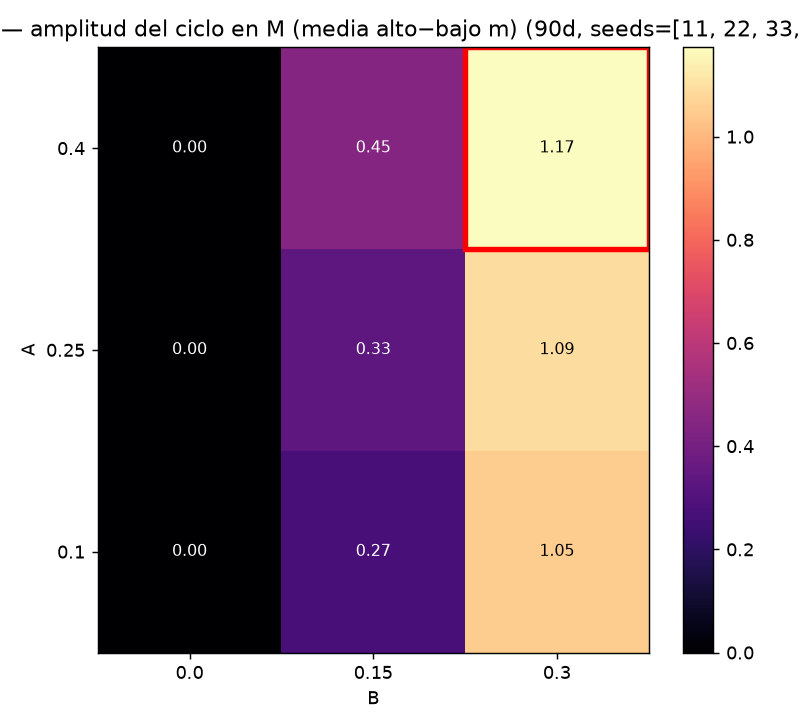
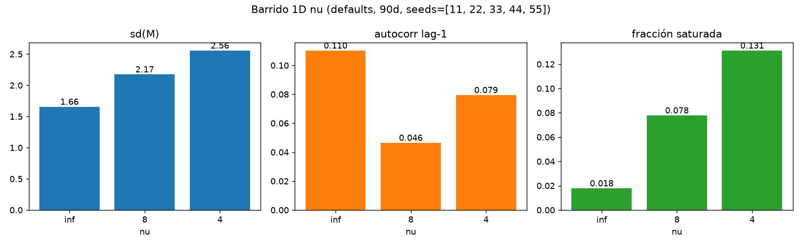
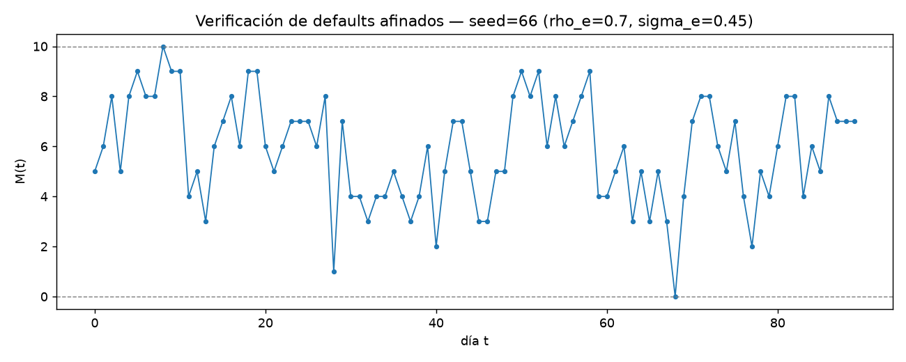

# W3.3 — Parameter sweep (criterion 8b)

Fixed variant: `decoupled_offsets`. Horizon: 90 days. Sweep seeds: `[11, 22, 33, 44, 55]` (metrics averaged across the 5 per cell). Verification (fresh) seeds: `[66, 77, 88, 99, 110]`.

Criterion (8b) — human region: mean(M) ∈ [5.25, 6.75], sd(M) ∈ [1.2, 2.8], autocorr_lag1 ∈ [0.2, 0.5], saturated_fraction < 0.1.

## 1. rho_e x sigma_e grid (endogenous autocorrelation)





Cells inside the human region: **5** of 16. autocorr_lag1 range: [0.083, 0.511]; sd(M) range: [1.56, 2.40].

Human cells (rho_e, sigma_e) → metrics:

- rho_e=0.5, sigma_e=0.45: mean=6.15 sd=1.99 ac1=0.227 sat=0.033
- rho_e=0.7, sigma_e=0.3: mean=6.21 sd=1.87 ac1=0.203 sat=0.031
- rho_e=0.7, sigma_e=0.45: mean=6.04 sd=2.17 ac1=0.391 sat=0.044
- rho_e=0.85, sigma_e=0.2: mean=6.23 sd=1.80 ac1=0.261 sat=0.024
- rho_e=0.85, sigma_e=0.3: mean=5.99 sd=2.08 ac1=0.407 sat=0.036

Reading: the earlier smoke with defaults (rho_e=0.5, sigma_e=0.2) gave autocorr ≈ 0.16, below target. Raising rho_e (more memory in the η AR(1)) pushes autocorr_lag1 up without changing η's stationary sd (σ_e/√(1−ρ_e²)) as much as raising σ_e directly; high sigma_e with high rho_e simultaneously inflates sd(M) and can approach saturation in the tails of p(t).

## 2. k x rho grid (event memory)





Cells **unstable by design** (violate k < 2(1−rho)/g_max):

- k=0.3, rho=0.85: k: violates stability bound k < 2(1−rho)/g_max (0.3 >= 0.223881, g_max=1.34)
- k=0.44, rho=0.85: k: violates stability bound k < 2(1−rho)/g_max (0.44 >= 0.223881, g_max=1.34)

Cells inside the human region: **2** of 10 stable cells (of 12 total).

Human cells (k, rho) → metrics:

- k=0.3, rho=0.5: mean=6.47 sd=1.67 ac1=0.222 sat=0.027
- k=0.44, rho=0.5: mean=6.70 sd=1.69 ac1=0.275 sat=0.036

Reading: k and rho control the judge→μ loop memory, not η's endogenous autocorrelation — their effect on M's autocorr_lag1 is weaker and indirect (via the variance they add to p(t) day to day); high rho with k near the stability bound is where sd(M) rises most.

## 3. A x B grid (cycle)





Cells inside the human region: **1** of 9. var_ratio_by_gain grows with A (gain amplifies reactivity); the cycle amplitude in M grows with B (mean shift m(t)) and is ~0 when B=0 by construction.

Human cells (A, B) → metrics:

- A=0.4, B=0.3: mean=6.36 sd=1.72 ac1=0.201 sat=0.020 var_ratio=0.86 amplitude=1.17

## 4. 1D nu sweep (defaults, beta-binomial overdispersion)



| nu | mean(M) | sd(M) | autocorr_lag1 | sat_frac |
|---|---|---|---|---|
| inf | 6.38 | 1.66 | 0.110 | 0.018 |
| 8 | 6.33 | 2.17 | 0.046 | 0.078 |
| 4 | 6.34 | 2.56 | 0.079 | 0.131 |

Reading: going from nu=inf to nu=4, autocorr_lag1 **decreased** (0.110 → 0.079) and sd(M) **increased** (1.66 → 2.56), consistent with beta-binomial overdispersion adding white (non-autocorrelated) variance on top of the pure binomial.

## Proposed tuned defaults

From grid 1 (the only source of pure endogenous autocorrelation), the point that brings autocorr_lag1 closest to the center of the target range [0.2, 0.5] without leaving sd(M) ≤ 2.8 or saturating is chosen. Everything else stays at the `PersonaParams()` default.

```python
PersonaParams(
    N=10,
    lam=0.6,
    nu=inf,
    k=0.15,
    rho=0.7,
    rho_e=0.7,  # <- tuned
    sigma_e=0.45,  # <- tuned
    B=0.15,
    A=0.25,
    sigma_eps=0.03,
    L_mean=28.0,
    L_sd=1.5,
    phi=0.0,
    score_neutral=0.0,
)
```

Justification: (1) rho_e=0.7 and sigma_e=0.45 place M's autocorr_lag1 in the target range — the previous default (rho_e=0.5, sigma_e=0.2) gave ≈0.16 in smoke, below the 0.2 floor. (2) The remaining parameters (k, rho, A, B, nu, N, lam) are left untouched because grids 2–4 show their effect on autocorr_lag1 is weaker or goes the wrong way (finite nu lowers it, not raises it) vs what rho_e/sigma_e offer. (3) Verified with 5 fresh seeds to rule out overfitting to the sweep seeds.

### Verification (fresh seeds)

Seeds: `[66, 77, 88, 99, 110]`.

| metric | value | target range | passes |
|---|---|---|---|
| mean(M) | 5.8267 | (5.25, 6.75) | PASS |
| sd(M) | 2.0704 | (1.2, 2.8) | PASS |
| autocorr_lag1 | 0.3934 | (0.2, 0.5) | PASS |
| sat_frac | 0.0267 | < 0.1 | PASS |



## Verdict (8b): **PASS**

A non-empty region meeting all 4 criterion (8b) thresholds exists (grid 1: 5 cells, grid 2: 2 cells, grid 3: 1 cell), and the tuned-defaults proposal was verified with 5 fresh seeds (PASS). PASS of (8b) = non-empty region + verified proposal.
