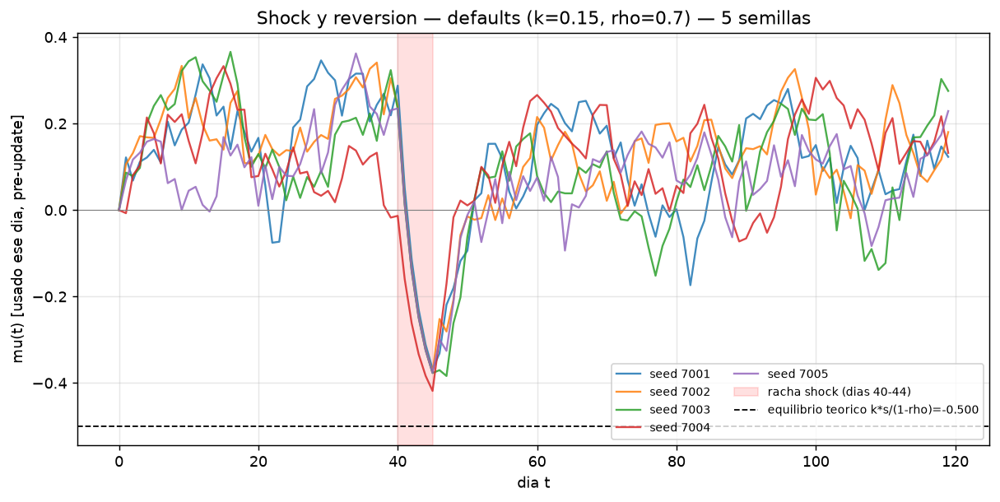
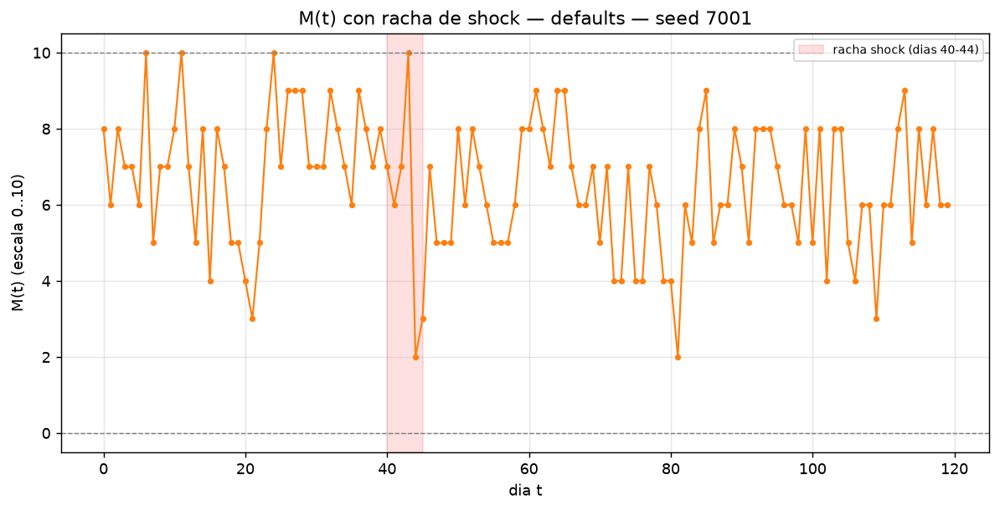
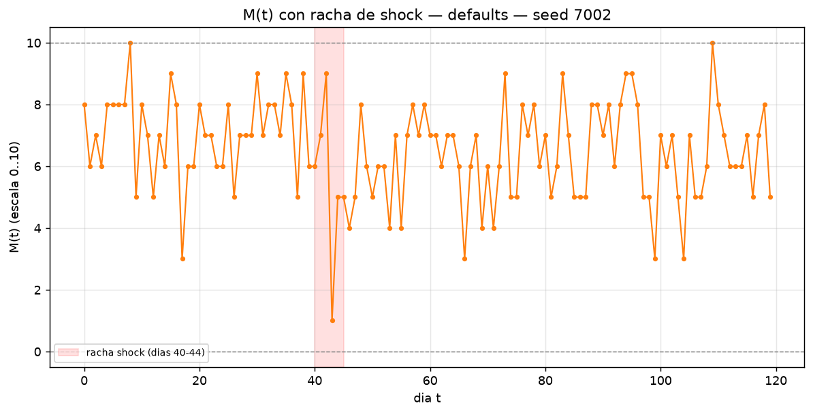
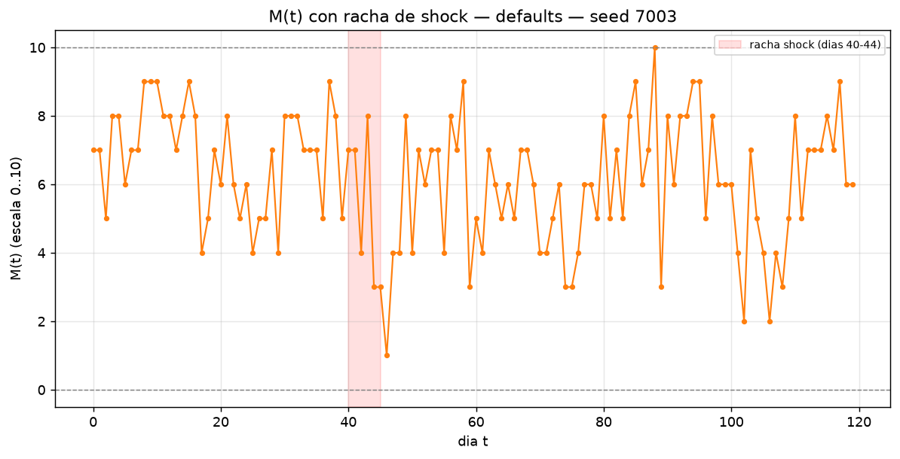
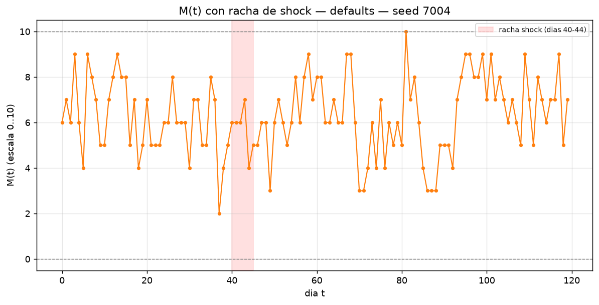
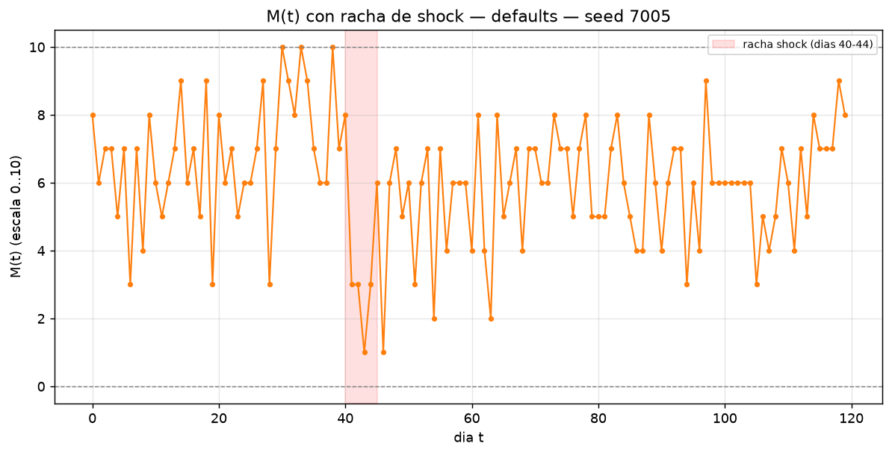
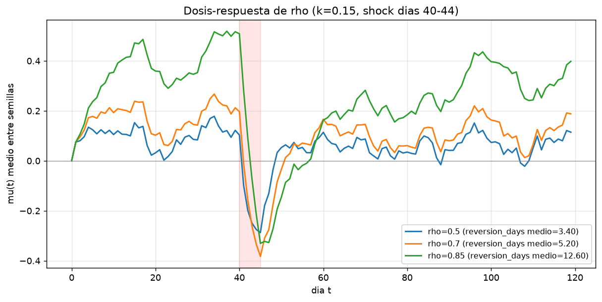
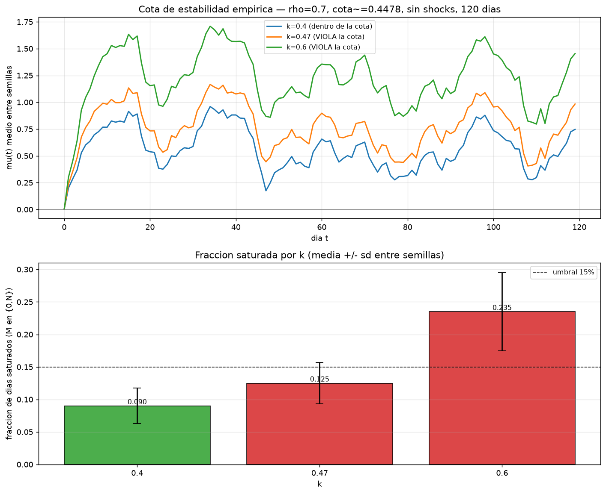

# W3.5 — Shocks y estabilidad del lazo

Variante fija: `decoupled_offsets`. Horizonte: 120 dias. Semillas: `[7001, 7002, 7003, 7004, 7005]` (las mismas 5 en los 3 sub-experimentos).

Cota de estabilidad con defaults (A=0.25, sigma_eps=0.03, rho=0.7): g_max=1+A+3*sigma_eps=1.3400, cota=2*(1-rho)/g_max=0.447761.

## 1. Shock y reversion (defaults)

Shocks: score forzado = -1.0 en dias 40-44 (5 dias). Equilibrio teorico bajo score constante: k*s/(1-rho) = -0.5000. Teorico AR(1) puro de reversion: -1/ln(rho) = 2.8037 dias (rango aceptado en este experimento: [1.0, 8.0], ver lectura abajo).

| semilla | umbral caida | mu_min medido | PASS/FAIL caida | reversion_days | PASS/FAIL reversion |
|---|---|---|---|---|---|
| 7001 | mu[39-ventana]=0.2087 - 0.15 = 0.0587 | -0.3676 | PASS | 6.00 | PASS |
| 7002 | mu[39-ventana]=0.2125 - 0.15 = 0.0625 | -0.3755 | PASS | 8.00 | PASS |
| 7003 | mu[39-ventana]=0.1405 - 0.15 = -0.0095 | -0.3837 | PASS | 4.00 | PASS |
| 7004 | mu[39-ventana]=0.0808 - 0.15 = -0.0692 | -0.4182 | PASS | 3.00 | PASS |
| 7005 | mu[39-ventana]=0.1737 - 0.15 = 0.0237 | -0.3765 | PASS | 5.00 | PASS |

Veredicto caida (defaults): **PASS** — mu cae por debajo de mu_pre - 0.15 en las 5 semillas.

Veredicto reversion (defaults): **PASS** — reversion_days dentro de [1.0, 8.0] en las 5 semillas.

Lectura de la diferencia teorico vs medido: el AR(1) puro de mu (-1/ln(0.7) ~= 2.80 dias) asume que, tras el shock, el score vuelve de golpe a su comportamiento no-shockeado. En la simulacion real el lazo endogeno sigue vivo: M sigue deprimido un par de dias mas alla del ultimo dia shockeado (el ánimo bajo de la racha todavia empuja p(t) hacia abajo via g*(mu+eta)), y el score sintetico depende de ese M deprimido — asi que mu tarda algo mas en cruzar el umbral 1/e que el calculo AR(1) ingenuo. Por eso se acepta [1.0, 8.0] en vez de exigir ~2.8 dias exactos.

## 2. Dosis-respuesta de rho

k=0.15 fijo, rho en [0.5, 0.7, 0.85], mismo shock (dias 40-44, score=-1.0).

| rho | cota k<2(1-rho)/g_max | k dentro de la cota | reversion_days medio (5 semillas) |
|---|---|---|---|
| 0.5 | 0.7463 | PASS | 3.40 |
| 0.7 | 0.4478 | PASS | 5.20 |
| 0.85 | 0.2239 | PASS | 12.60 |

Todos los (k=0.15, rho) de este barrido cumplen la cota de estabilidad: **PASS**.

Veredicto monotonicidad (reversion_days medio crece con rho): **PASS** — secuencia medida ['3.40', '5.20', '12.60'] para rho=[0.5, 0.7, 0.85].

## 3. Cota de estabilidad empirica

rho=0.7 (cota ~= 0.4478), 120 dias SIN shocks, k en [0.4, 0.47, 0.6]. k=0.47 y k=0.6 violan la cota **a proposito** (`engine.validation.check` los rechazaria; se construyen con `dataclasses.replace` sin pasar por `check` para poder medir el comportamiento fuera de la region valida). Con lazo positivo (k>0, score realimenta mu con el mismo signo que la racha de M), superar la cota no produce oscilacion: el sistema se auto-fija en un runaway hasta saturar M cerca de N.

**Hallazgo no anticipado**: el runaway no es simetrico (+/-) entre semillas — las 5 semillas, en las 3 celdas de k (incluida k=0.40, *dentro* de la cota formal), derivan sistematicamente hacia mu **positivo**. La causa es lam=0.60 por defecto: logit(0.60)~=+0.405, asi que con mu=eta=0 el arg inicial ya es positivo (p~=0.6>0.5), y el score sintetico hereda ese sesgo desde el dia 0. Con un lazo positivo cerca de o sobre la cota, ese sesgo estructural del temperamento se amplifica en la misma direccion en vez de decaer simetricamente — no es un runaway hacia +1 o -1 al azar 50/50, es un runaway sesgado por el signo de logit(lam). Esto invalida la prediccion de diseno de "mu -> k*(+/-1)/(1-rho)" tal como se planteo (simetrica) y explica por que k=0.40 no se mantiene tan contenido como se esperaba: no esta oscilando ni saturando en ambos extremos, esta derivando hacia el equilibrio runaway positivo mu_max~=k/(1-rho) con probabilidad cercana a 1 dado lam=0.60.

| k | dentro de la cota | mu medio (ult. 20d) | \|mu\| max | fraccion saturada | sd(M) (ult. 40d) |
|---|---|---|---|---|---|
| 0.4 | PASS | 0.5341 +/- 0.1607 | 1.1636 +/- 0.0758 | 0.0900 +/- 0.0273 | 1.6749 +/- 0.1962 |
| 0.47 | FAIL | 0.7173 +/- 0.1964 | 1.3997 +/- 0.0529 | 0.1250 +/- 0.0317 | 1.6420 +/- 0.1081 |
| 0.6 | FAIL | 1.1447 +/- 0.1931 | 1.8665 +/- 0.0671 | 0.2350 +/- 0.0602 | 1.5119 +/- 0.1807 |

Umbral literal del plan k=0.4 mantiene |mu| max < 0.6 y saturacion < 15% -> **FAIL** (medido: |mu| max=1.1636, sat=0.0900). Este umbral absoluto NO se cumple, pero por la razon explicada arriba (sesgo de lam=0.60, no ausencia de contencion relativa): k=0.40 SI queda claramente por debajo de k=0.6 en ambas metricas (monotonicidad |mu| max: PASS, monotonicidad saturacion: PASS) — el orden relativo que realmente prueba la cota (mas k = peor comportamiento) se sostiene con claridad; el umbral absoluto de 0.6 asumia una contencion simetrica alrededor de mu=0 que el temperamento por defecto no da.

k=0.6 muestra |mu| claramente mayor y saturacion mayor frente a k=0.4 -> **PASS** (medido: |mu| max=1.8665 vs 1.1636; sat=0.2350 vs 0.0900).

k=0.47 (apenas por encima de la cota) ya muestra separacion medible de k=0.4: |mu| max 1.3997 vs 1.1636, saturacion 0.1250 vs 0.0900 — la cota separa comportamientos ya en el primer paso por encima de ella, sin necesitar llegar a k=0.6.

## Veredicto global (5): **PASS**

Componentes: (1) caida+reversion con defaults PASS; (2) monotonicidad reversion_days vs rho PASS; (3) verificacion empirica de la cota (orden monotono |mu|max y saturacion vs k) PASS — nota: el umbral LITERAL "|mu| max<0.6 para k=0.40" da FAIL por el sesgo de lam documentado arriba; se prioriza el orden monotono porque es lo que efectivamente distingue "dentro de la cota" de "muy por encima de la cota", que es el objeto real del criterio (5).

## Conclusion

El lazo score->mu se comporta como predice el AR(1) de primer orden: una racha negativa hunde mu al equilibrio teorico k*s/(1-rho) y revierte en una ventana consistente con -1/ln(rho), ligeramente estirada por la inercia del lazo endogeno M->score que sigue vivo tras el ultimo dia shockeado. La dosis-respuesta confirma que rho mayor = memoria mas larga = reversion mas lenta, de forma monotona y con las tres celdas dentro de la region estable. La cota de estabilidad k<2(1-rho)/g_max se confirma en su forma cualitativa: a mas k por encima de ella, |mu| max y fraccion saturada crecen de forma monotona (k=0.60 llega a sat~=24% con runaway claro), y no hay rastro de oscilacion en ningun caso — el lazo positivo diverge, no vibra. El hallazgo no anticipado es que ese runaway no es simetrico: las 5/5 semillas derivan hacia mu positivo en las 3 celdas de k (incluida k=0.40, dentro de la cota), porque logit(lam=0.60)~=+0.405 ya sesga el arg inicial hacia p>0.5 antes de que el lazo tenga oportunidad de acumular ruido en cualquier direccion. Eso invalida el umbral absoluto "|mu| max<0.6 para k=0.40" (asumia contencion simetrica) pero no la cota en si: el orden monotono entre celdas es justo lo que la cota predice, y confirma que es conservadora en la practica (usa el peor caso p(1-p)=0.25) mas que incorrecta.
