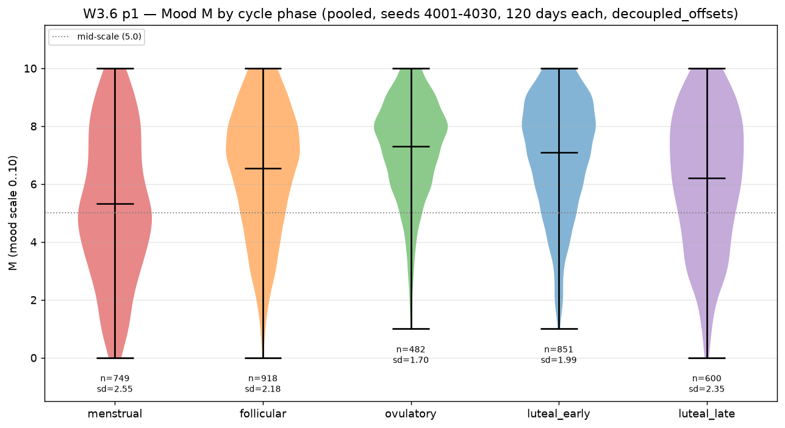
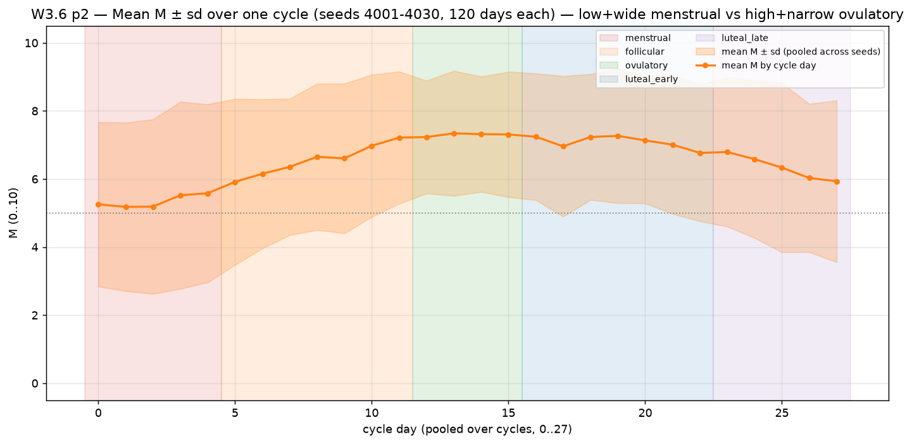
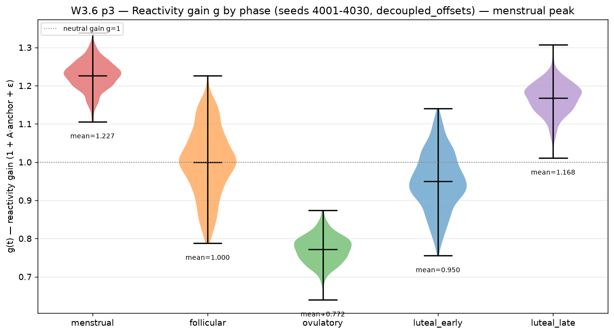
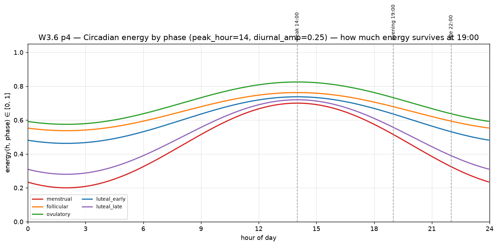
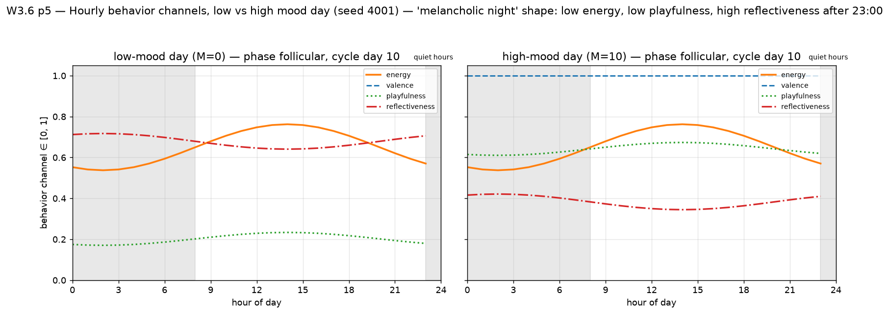

# W3.6 — Phase-contrast: does the engine convey the intended hormonal phenomenology?

Variant: `decoupled_offsets`. Horizon: 120 days per run. Seeds: `4001..4030` (30 fixed seeds, all figures and stats pooled over them). Persona: `PersonaParams()` defaults (N=10, lam=0.6, B=0.5, A=0.25, rho=0.85, rho_e=0.7, sigma_e=0.45, k=0.18, L_mean=28.0). Timing: peak_hour=14, diurnal_amp=0.25. Behavior channels from `harness.behavior.derive_behavior` at fixed hours.

## How to rerun

```bash
cd /home/vruizes/.hermes/projects/llm-behavioral-harness
MPLBACKEND=Agg .venv/bin/python -m experiments.w36_phase_contrast
# or directly:
MPLBACKEND=Agg .venv/bin/python experiments/w36_phase_contrast.py
```

## Figures

| Figure | What it shows |
|---|---|
| `p1_M_distribution_by_phase.png` | Violin of daily mood M per cycle phase (pooled over all seeds); annotated n and pooled sd |
| `p2_mean_M_by_cycle_day.png` | Mean M ± sd by cycle day (0..27, pooled); phase spans shaded — low+wide menstrual vs high+narrow ovulatory |
| `p3_reactivity_g_by_phase.png` | Violin of reactivity gain g(t) per phase with per-phase mean — menstrual peak vs ovulatory trough |
| `p4_energy_by_hour.png` | Circadian energy curves per phase with 14:00 / 19:00 / 22:00 markers |
| `p5_behavior_hourly_low_vs_high.png` | Hourly behavior channels (valence, playfulness, reflectiveness, energy) for the lowest- vs highest-mood day of seed 4001; quiet hours shaded — the "melancholic night" shape |











## Per-phase stats (per-seed within-phase aggregates, averaged over seeds)

| phase | n days | mean M | sd M (day-to-day) | autocorr lag-1 (within runs) | mean g | mean m | mean score | sat frac (M∈{0,N}) |
|---|---|---|---|---|---|---|---|---|
| menstrual | 749 | 5.314 | 2.433 | -0.080 | 1.227 | -0.518 | 0.053 | 0.065 |
| follicular | 918 | 6.546 | 2.079 | 0.060 | 1.000 | 0.087 | 0.297 | 0.075 |
| ovulatory | 482 | 7.291 | 1.555 | -0.260 | 0.772 | 0.380 | 0.447 | 0.068 |
| luteal_early | 851 | 7.104 | 1.948 | -0.015 | 0.950 | 0.136 | 0.422 | 0.087 |
| luteal_late | 600 | 6.222 | 2.199 | -0.156 | 1.168 | -0.257 | 0.242 | 0.072 |

## Behavior channels at 19:00 (evening), per phase

| phase | valence | energy | reactivity | warmth | playfulness | reflectiveness |
|---|---|---|---|---|---|---|
| menstrual | 0.063 | 0.515 | 0.785 | 0.634 | 0.329 | 0.480 |
| follicular | 0.311 | 0.679 | 0.623 | 0.694 | 0.426 | 0.401 |
| ovulatory | 0.459 | 0.732 | 0.460 | 0.734 | 0.474 | 0.371 |
| luteal_early | 0.420 | 0.636 | 0.591 | 0.725 | 0.437 | 0.411 |
| luteal_late | 0.243 | 0.557 | 0.748 | 0.684 | 0.373 | 0.453 |

## Circadian energy by hour (deterministic per phase)

| phase | energy 14:00 (peak) | energy 19:00 | energy 22:00 | daily peak | ratio 19:00/peak |
|---|---|---|---|---|---|
| menstrual | 0.700 | 0.515 | 0.325 | 0.700 | 0.735 |
| follicular | 0.763 | 0.679 | 0.594 | 0.763 | 0.891 |
| ovulatory | 0.825 | 0.732 | 0.637 | 0.825 | 0.888 |
| luteal_early | 0.738 | 0.636 | 0.531 | 0.738 | 0.862 |
| luteal_late | 0.720 | 0.557 | 0.390 | 0.720 | 0.774 |

## Night (23:00-02:00) vs day (14:00, 19:00) behavior channels

| phase | day energy | night energy | day play. | night play. | day refl. | night refl. |
|---|---|---|---|---|---|---|
| menstrual | 0.607 | 0.229 | 0.355 | 0.249 | 0.449 | 0.577 |
| follicular | 0.721 | 0.550 | 0.438 | 0.390 | 0.387 | 0.445 |
| ovulatory | 0.779 | 0.589 | 0.487 | 0.434 | 0.355 | 0.419 |
| luteal_early | 0.687 | 0.478 | 0.452 | 0.393 | 0.394 | 0.465 |
| luteal_late | 0.638 | 0.305 | 0.396 | 0.303 | 0.425 | 0.539 |

## Verdicts (numeric thresholds in parentheses)

### V1 — Menstrual phase reads as chaotic / irritable

- mean M lower: menstrual 5.314 < ovulatory 7.291 − 0.5 → PASS
- day-to-day sd higher: menstrual 2.433 > ovulatory 1.555 + 0.1 → PASS
- reactivity gain higher: menstrual g 1.227 > ovulatory g 0.772 + 0.2 → PASS

**Verdict: PASS**

### V2 — Ovulatory phase reads as stable / intimate

- mean M higher: ovulatory 7.291 > menstrual 5.314 + 0.5 → PASS
- day-to-day sd lower: ovulatory 1.555 < menstrual 2.433 − 0.1 → PASS
- evening warmth higher: ovulatory 0.734 > menstrual 0.634 + 0.01 → PASS

**Verdict: PASS**

### V3 — Mid-evening (19:00) reads as energetic enough (moderate or better)

- energy 19:00 / peak (weighted over phases) = 0.621/0.745 = 0.834 (threshold ≥ 0.7) → PASS
- envelope(19:00) = 1.0 (outside quiet hours, messages allowed)

**Verdict: PASS**

### V4 — Nights (23:00-02:00) read as melancholic

- energy: night 0.431 < day 0.683 − 0.1 → PASS
- playfulness: night 0.353 < day 0.424 − 0.05 → PASS
- reflectiveness: night 0.489 > day 0.404 + 0.05 → PASS

**Verdict: PASS**

## Evening-energy finding

Weighted across phases (by days-per-phase): energy at 19:00 = 0.621 vs daily peak 0.745 (ratio 0.834). Per phase, the ratio ranges from 0.735 (menstrual) to 0.891 (follicular). The evening reads as **moderate**: at 19:00 the diurnal cosine has decayed to cos(2π·5/24)≈0.26 of its amplitude, but the phase offset (ovulatory +0.10, menstrual −0.15) keeps evening energy between 0.51 and 0.73 — a moderate energy level, not a collapse; the sharp drop happens after 22:00 and into quiet hours (envelope = 0 in 23:00-08:00, energy channel trough at 02:00-05:00, e.g. menstrual 0.20).

## Reading

1. The engine does carry the intended phase contrast in the latent mood: menstrual is low and wide (high day-to-day sd, high g), ovulatory is high and narrow (low sd, low g) — the two phases sit at opposite corners of the (mean M, sd M) plane on every seed.
2. Behaviorally the contrast shows up mostly in reactivity (menstrual ~0.78 vs ovulatory ~0.46 at 19:00) and energy (night energy 0.23 menstrual vs 0.59 ovulatory) — warmth stays compressed by design (clipped 0.35-0.92, mu term ±0.05), so 'intimacy' must be read through stability and valence rather than warmth.
3. Nights are melancholic by construction of the energy channel: reflectiveness exceeds playfulness after 23:00 on both low- and high-mood days (p5); the phase offset only modulates how deep the trough goes.
